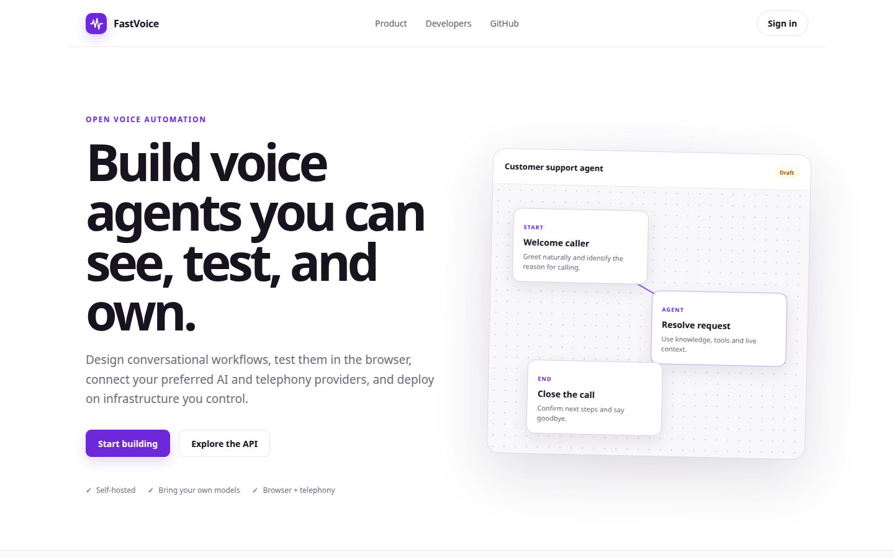
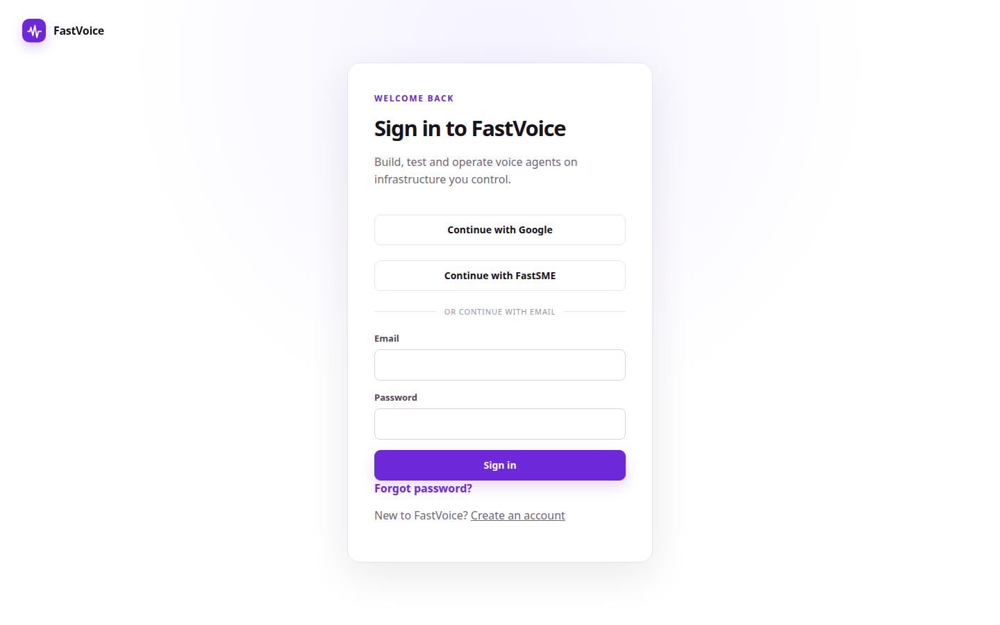
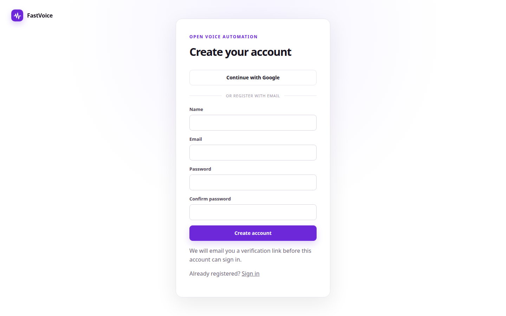
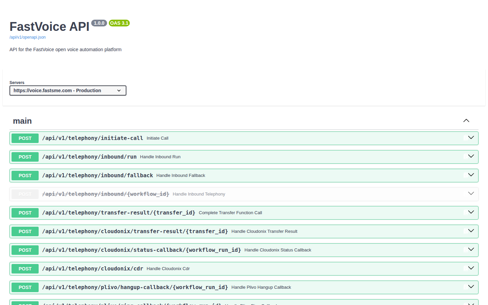

# FastVoice Platform Guide

**Published:** 2026-08-19
**Platform:** [https://voice.fastsme.com](https://voice.fastsme.com)
**Source:** [github.com/predictivelabsai/FastVoice](https://github.com/predictivelabsai/FastVoice)

## Platform overview

FastVoice is a self-hosted voice-agent platform built with Python, FastHTML, HTMX, and browser-native JavaScript. It combines a visual workflow editor, live browser testing, outbound campaigns, telephony, knowledge retrieval, tools, recordings, model configuration, REST APIs, MCP, and a typed Python SDK in one deployab

This visual guide was reviewed against the live product using Playwright. Screens and available navigation can vary by account, role, and deployment configuration.

## 1. Build voice agents you can see, test, and own.

OPEN VOICE AUTOMATION Build voice agents you can see, test, and own. Design conversational workflows, test them in the browser, connect your preferred AI and telephony providers, and deploy on infrastructure you control. Start building Explore the API Self-hos

Screen reviewed at: [https://voice.fastsme.com/](https://voice.fastsme.com/)

## 2. Sign in to FastVoice

FastVoice WELCOME BACK Sign in to FastVoice Build, test and operate voice agents on infrastructure you control. Continue with GoogleContinue with FastSME OR CONTINUE WITH EMAIL Email Password Sign in Forgot password? New to FastVoice? Create an account

Screen reviewed at: [https://voice.fastsme.com/login](https://voice.fastsme.com/login)

## 3. Create your account

FastVoice OPEN VOICE AUTOMATION Create your account Continue with Google OR REGISTER WITH EMAIL Name Email Password Confirm password Create account We will email you a verification link before this account can sign in. Already registered? Sign in

Screen reviewed at: [https://voice.fastsme.com/signup](https://voice.fastsme.com/signup)

## 4. FastVoice API 1.0.0 OAS 3.1

main POST /api/v1/telephony/initiate-call Initiate Call POST /api/v1/telephony/inbound/run Handle Inbound Run POST /api/v1/telephony/inbound/fallback Handle Inbound Fallback POST /api/v1/telephony/inbound/{workflow_id} Handle Inbound Telephony POST /api/v1/tel

Screen reviewed at: [https://voice.fastsme.com/api/v1/docs](https://voice.fastsme.com/api/v1/docs)

## Getting started

Visit [https://voice.fastsme.com](https://voice.fastsme.com) to explore FastVoice. For source code and deployment details, use the GitHub link above.
